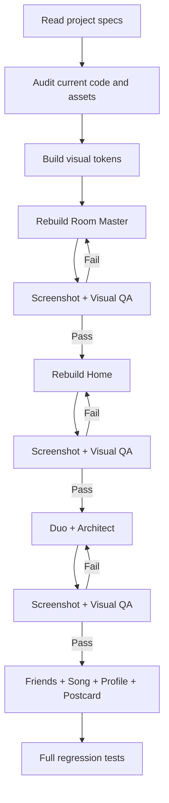

# Roomie Rebuild Flow

```mermaid
flowchart TD
  A[Read project specs] --> B[Audit current code and assets]
  B --> C[Build visual tokens]
  C --> D[Rebuild Room Master]
  D --> E[Screenshot + Visual QA]
  E -->|Fail| D
  E -->|Pass| F[Rebuild Home]
  F --> G[Screenshot + Visual QA]
  G -->|Fail| F
  G -->|Pass| H[Duo + Architect]
  H --> I[Screenshot + Visual QA]
  I -->|Fail| H
  I -->|Pass| J[Friends + Song + Profile + Postcard]
  J --> K[Full regression tests]
```

## Gate rules
- 不允许跳过 Room Master 直接批量改七页。
- Room Master 未通过视觉 QA，不得进入页面迁移。
- 连续三轮视觉修改无明显改善时，重新审查资产与构图。
